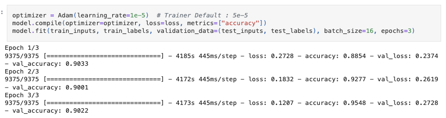
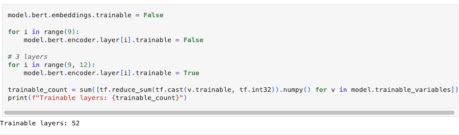
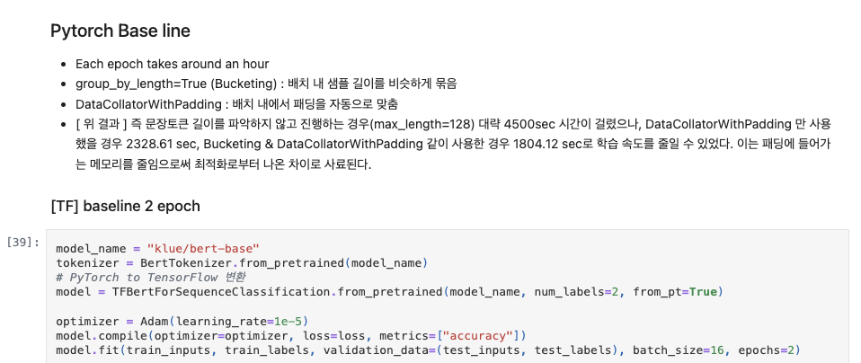
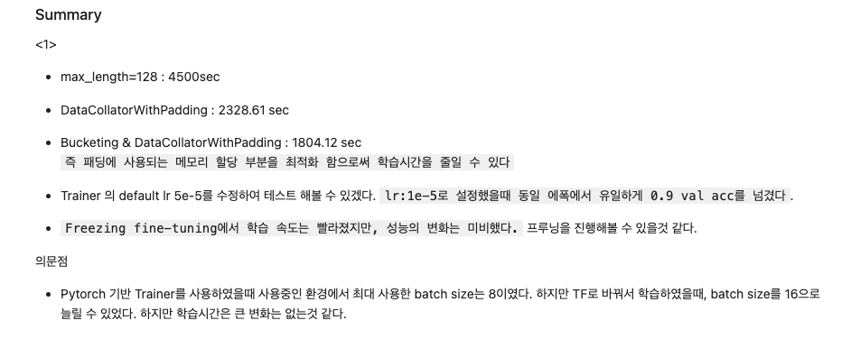
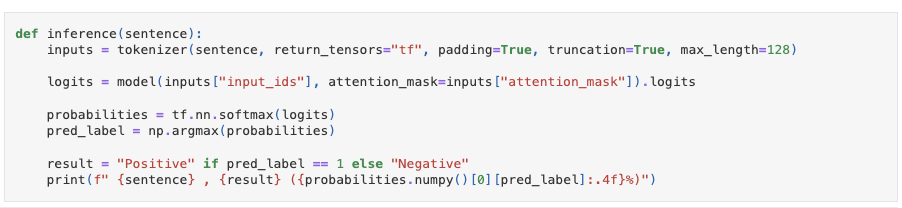

# AIFFEL Campus Online Code Peer Review Templete
- 코더 : 나 영진
- 리뷰어 : 김 영만


# PRT(Peer Review Template)
- [*]  **1. 주어진 문제를 해결하는 완성된 코드가 제출되었나요?**
    - klue/bert-base를 NSMC 데이터셋으로 fine-tuning 하여, 모델이 정상적으로 작동하는 것을 확인 하였습니다.
        - 

- [*]  **2. 전체 코드에서 가장 핵심적이거나 가장 복잡하고 이해하기 어려운 부분에 작성된 
주석 또는 doc string을 보고 해당 코드가 잘 이해되었나요?**
    - 레이어를 조정하여 진행 한 부분이 잘 이해 되었습니다.
        - 
        
- [*]  **3. 에러가 난 부분을 디버깅하여 문제를 해결한 기록을 남겼거나
새로운 시도 또는 추가 실험을 수행해봤나요?**
    - 다양한 데이터 셋 포맷과 epoch로 비교 시험 하였습니다.
        - 
        
- [*]  **4. 회고를 잘 작성했나요?**
    - 결과와 의문정에 대한 기술이 잘 되어 있습니다.
        - 
        
- [*]  **5. 코드가 간결하고 효율적인가요?**
    - 실제 문장으로 정확도를 확인하는 함수가 간결하게 잘 작성 되었습니다.
         - 


# 회고(참고 링크 및 코드 개선)
```
다양한 포맷과 케이스들에 대한 실험 결과가 인상적이었습니다.
특히 레이어에 변화를 주면서 진행한 실험은 좋았습니다.
수고 많이 하셨습니다.
```

